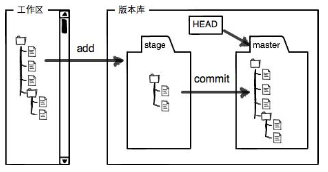

#Git常用命令
[toc]
###指定仓库的用户名和Email地址
>git config --global user.name "Your Name"
>git config --global user.email "email@example.com"

*注意 `git config`命令的 `--global` 参数，用了这个参数，表示你这台机器上所有的Git仓库都会使用这个配置，当然也可以对某个仓库指定不同的用户名和 Email地址。*
___
###创建版本库
>git init   

*将该目录初始化为可管理的仓库，生成.git目录*
___
###把文件添加到版本库
所有的版本控制系统，其实只能跟踪文本文件的改动，比如TXT文件，网页，所有的程序代码等等，Git也不例外。版本控制系统可以告诉你每次的改动，比如在第5行加了一个单词“Linux”，在第8行删了一个单词“Windows”。而图片、视频这些二进制文件，虽然也能由版本控制系统管理，但没法跟踪文件的变化，只能把二进制文件每次改动串起来，也就是只知道图片从100KB改成了120KB，但到底改了啥，版本控制系统不知道，也没法知道。
不幸的是，Microsoft的Word格式是二进制格式，因此，版本控制系统是没法跟踪Word文件的改动的，前面我们举的例子只是为了演示，如果要真正使用版本控制系统，就要以纯文本方式编写文件。
因为文本是有编码的，比如中文有常用的GBK编码，日文有Shift_JIS编码，如果没有历史遗留问题，强烈建议使用标准的UTF-8编码，所有语言使用同一种编码，既没有冲突，又被所有平台所支持。

1.将文件添加到仓库
>git add readme.txt

2.把文件提交到仓库
>git commit -m "wrote a readme file"
*-m后面输入的是本次提交的说明，可以输入任意内容，当然最好是有意义的，这样你就能从历史记录里方便地找到改动记录。*

为什么Git添加文件需要add，commit一共两步呢？因为commit可以一次提交很多文件，所以你可以多次add不同的文件，比如：

    \$ git add file1.txt
    \$ git add file2.txt file3.txt
    \$ git commit -m "add 3 files."
___

###时光机穿梭
####查看仓库状态
>git status

查看文件是否被修改，是否有待提交的修改。

####比较版本变动
1.**比较工作区与其他**
>git diff readme.txt  
不加参数默认比较工作区与暂存区,因git add后工作区和暂存区没有区别

>git diff HEAD readme.txt
比较工作区与最新版本库，git commit前均能查到此区别

>git diff commit-id readme.txt
比较工作区与指定commit-id的差异

2.**比较暂存区与其他**
>git diff --cached readme.txt
比较暂存区与最新本地库

>git diff --cached [\<commit-id\>] [\<path>...] 
比较暂存区与指定commit-id的差异

在 `git add` 修改之前使用 `git diff` 命令查看修改内容。
>git diff readme.txt
省略文件名将输出所有文件变动情况

输出：
>diff --git a/readme.txt b/readme.txt
index 46d49bf..9247db6 100644
--- a/readme.txt
+++ b/readme.txt
@@ -1,2 +1,2 @@
-Git is a version control system.
+Git is a distributed version control system.
Git is free software.

>--- a/readme.txt
+++ b/readme.txt

\---表示变动前的文件
+++表示变动后的文件
>@@ -1,2 +1,2 @@

表示文件变动描述合并显示的开始和结束，一般在变动前后多显示3行，其中-、+表示变动前后，逗号前是起始行位置，逗号后为从起始行往后几行。合起来就是变动前后都是从第1行开始，变动前文件往后数2行对应变动后文件往后数2行。
 
>-Git is a version control system.
+Git is a distributed version control system.
Git is free software.

变动内容，+表示增加了这一行，-表示删除了这一行，没符号表示此行没有变动。

####查看提交日志
查看提交记录, `git log` 命令显示从最近到最远的提交日志;HEAD指针指示当前版本。
>git log

参数 `--pretty=oneline` 不输出作者信息，只输出commit id、提交说明、当前指针信息，输出更简洁；
>git log --pretty=oneline

####版本回退
首先，Git必须知道当前版本是哪个版本，在Git中，用HEAD表示当前版本，上一个版本就是HEAD^，上上一个版本就是HEAD^^，当然往上100个版本写100个^比较容易数不过来，所以写成HEAD~100。

回退到上个版本：
--hard参数待补充
>git reset --hard HEAD^

若回退后想返回到最新版本，可以指定commit id，设置为当前版本，commit id 无需完整填写，只需前几位唯一确定一个版本即可：
>git restet --hard < commit id >  

####命令日志
Git提供了一个命令 `git reflog` 用来记录你的每一次命令：

    $ git reflog
    e475afc HEAD@{1}: reset: moving to HEAD^
    1094adb (HEAD -> master) HEAD@{2}: commit: append GPL
    e475afc HEAD@{3}: commit: add distributed
    eaadf4e HEAD@{4}: commit (initial): wrote a readme file

此命令可用来查看特定的版本号，以便回退后可返回“未来”。

___
###工作区和暂存区
**工作区（Working Directory)**:即存放工作文件的目录。

**版本库（Repository）**：工作区有一个工作区有一个隐藏目录 .git，这个不算工作区，而是Git的版本库，它是在创建仓库时自动生成的。
Git的版本库里存了很多东西，其中最重要的就是称为**stage**（或者叫index）的暂存区，还有Git为我们自动创建的第一个分支**master**，以及指向master的一个指针叫**HEAD**。

前面讲了我们把文件往Git版本库里添加的时候，是分两步执行的：

第一步是用git add把文件添加进去，实际上就是把文件修改添加到暂存区；

第二步是用git commit提交更改，实际上就是把暂存区的所有内容提交到当前分支。

因为我们创建Git版本库时，Git自动为我们创建了唯一一个master分支，所以，现在，git commit就是往master分支上提交更改。

你可以简单理解为，需要提交的文件修改通通放到暂存区，然后，一次性提交暂存区的所有修改。

___

###撤销修改

